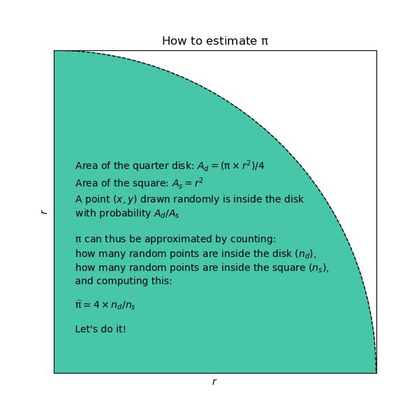
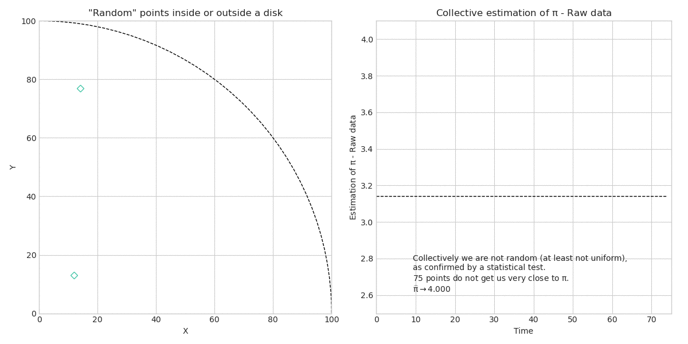

# Pi day: collective estimation of pi

Here is the prompt I gave to my colleagues:
> Happy pi day! March 14th is traditionally associated to pi as the date is written 3/14 in the US. In other countries, July 22nd would work better as 22/7 = 3.1429... which is actually closer to pi.
> Game for today: we can compute an approximation of pi collectively!
> Please give me two random numbers between 0 and 100.
> As more people participate we will use the numbers to get closer to pi, as you will see.
> You can do it several times if you like.

And here is the outcome...

First of all: why are random numbers handy to estimate pi?
Find the answer in this graph.

OK, that's why I asked for pairs of random numbers, they are coordinates.  
You can see in the animation below that the evolving value kind of estimates pi, but not quite. Why? First of all, there are 75 pairs, which is a modest number. And second, the random numbers would need to be uniformly distributed. I checked that they are not uniformly distributed, with a statistical test ([Kolmogorov-Smirnov](https://en.wikipedia.org/wiki/Kolmogorov%E2%80%93Smirnov_test), if you must know). So, news flash: humans (and in particular in our company) are not good at generating random numbers. Always nice to know we're not uniform.

So, can we do better? Théo and I thought: what if we bootstrap and augment our dataset? Sure, we can use symmetries (like in computer vision) and have 4 times as many samples, so 300 samples. See the following animation, better, but still not quite pi, and also, still not uniform (says the KS test).

Finally, with the suggestion of Weibing, I tried another random number generator: using the digits of pi: 03141592 gives two pairs (3, 14) and (15, 92), you can do that repeatedly to get 300 pairs. There's even an [API on the web that returns those digits](https://uploadbeta.com/api/pi/?cached&n=1200). So, are those numbers random enough? Yes, they match a uniform distribution. Well done, pi. See on the animation below how 300*4 = 1200 decimals of pi bring you closer to the value.  
(note: OK, that's a bit like a data leak to use pi in order to compute pi, but it would also work with e or sqrt(2) I [suppose](https://en.wikipedia.org/wiki/Normal_number))  
(note 2: another famous person using pi routinely as a random number generator is [Donald Knuth](https://en.wikipedia.org/wiki/Donald_Knuth))

Thank you, and see you next pi day!
